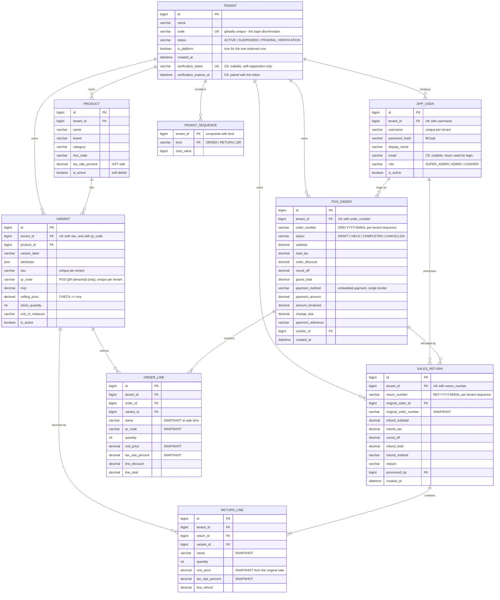

# ER diagram

The whole model on one screen. Column lists are trimmed to keys and the fields
that carry meaning — see [schema.md](./schema.md) for the full definitions.

> **Read `tenant` as the boundary, not just another table.** Every relationship
> below lives *inside* one tenant; nothing crosses. The `tenant_id` on child
> tables like `order_line` is deliberate denormalisation so the Hibernate filter
> applies uniformly — see [README.md](./README.md).

> **These arrows are database foreign keys, not Java object references.**
> Peer-review Phase 2 removed every `@ManyToOne`/`@OneToMany` from `com.pos.pojo`
> — a full retroactive sweep across all 9 mapped entities, not just new code. Every
> relationship below is still a real, database-enforced FK, same name and
> `ON DELETE` behavior as always (see
> [constraints-and-indexes.md](./constraints-and-indexes.md#foreign-keys) for the
> shadow-association mechanism that keeps it that way); reading the "far side" of
> one now goes through an explicit DAO call, never a lazy-loaded getter.

## Reading the diagram

**`TENANT_SEQUENCE` is the one table with no business meaning.** It exists because
going per-tenant meant giving up `AUTO_INCREMENT` — which was a concurrency-safe
number generator the database gave us for free. One row per `(tenant, kind)`, taken
under a row lock in the same transaction as the insert it numbers.

**`ORDER_LINE` and `RETURN_LINE` carry snapshots, not just foreign keys.** The
`variant_id` says *what was sold*; the `name` / `unit_price` / `tax_rate_percent`
say *on what terms*. A later price change must not rewrite history, and a refund
reads these back verbatim (`requirements.md` §3). Don't "normalise" them away.

**`SALES_RETURN` hangs off `POS_ORDER`, and inherits its tenant.** A return always
belongs to its original order's tenant — that's the rule, and the frontend
expresses it by inheriting rather than re-reading the session.

**Payment is embedded in `POS_ORDER`, not a separate table.** v1 is a single
payment covering the full amount, with no split tender (`requirements.md` §3/§12).
If split tender ever arrives, this is the join to extract.
